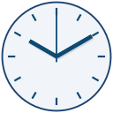
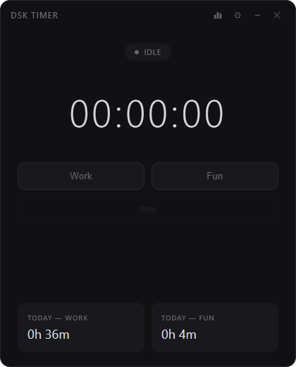
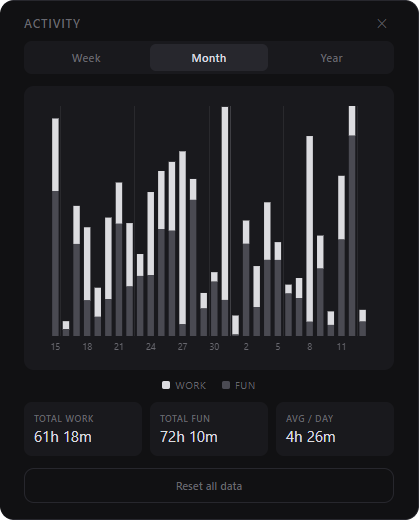
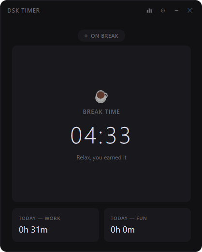
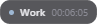

<p align="center">
  
</p>

<h1 align="center">DSK Timer</h1>

<p align="center">
  <strong>Desktop work &amp; fun timer for Windows</strong><br>
  <sub>System tray · data stays on your device · optional floating timer bar</sub>
</p>

<p align="center">
  <a href="https://github.com/ds-kimi/dsk_timer/releases"></a>
  <a href="https://github.com/ds-kimi/dsk_timer"></a>
  <a href="LICENSE"></a>
  
</p>

<p align="center">
  <b>Looking for the installer?</b> Open <a href="https://github.com/ds-kimi/dsk_timer/releases">Releases</a> and download the latest <code>DSK Timer Setup … .exe</code>.
</p>

<br>

## Screenshots

<table>
  <tr>
    <td width="50%" align="center">
      <a href="assets/main_ui.png"></a>
      <p align="center"><sub><b>Main</b> — work or fun session, elapsed time, today’s totals</sub></p>
    </td>
    <td width="50%" align="center">
      <a href="assets/stats.png"></a>
      <p align="center"><sub><b>Activity</b> — work vs fun by day (week, month, or year)</sub></p>
    </td>
  </tr>
  <tr>
    <td width="50%" align="center">
      <a href="assets/break_time.png"></a>
      <p align="center"><sub><b>Break</b> — rest countdown before work can resume</sub></p>
    </td>
    <td width="50%" align="center">
      <a href="assets/overlay.png"></a>
      <p align="center"><sub><b>Overlay</b> — small bar on top of other windows with status and time</sub></p>
    </td>
  </tr>
</table>

---

## What it does

- Start **Work** or **Fun** and track time as **hours : minutes : seconds**, plus today’s running totals.
- After enough continuous work, a **mandatory break** blocks work until the break timer finishes.
- Optional **fun limits** (per session and per day) can show Windows notifications and play short beeps in the app.
- The **Activity** screen shows work vs fun over time and lets you clear history if you want a fresh start.

---

## Features

| Area | What you get |
|------|----------------|
| **Tray** | Closing the window hides it; the app keeps running. Use the tray icon for **Show** or **Quit**. |
| **One window** | Opening the app again brings the same window to the front instead of starting a second copy. |
| **Your data** | Settings and past sessions are saved on your computer and are still there the next time you open the app. |
| **Idle pause** | Optional: pause the running session automatically after the PC has been idle long enough (configured in Settings). |
| **Floating bar** | Optional small bar that stays above normal windows with status and time. In Settings, use **Move…** / **Done** to place it. Full-screen apps (many games) may still hide it. |
| **Large displays** | The interface scales up on big or high-resolution screens so it stays easy to read. |
| **Sounds** | Volume slider for in-app beeps, with **Test** to preview. Windows notification sounds follow your system volume. |
| **Updates** | Installed versions can check for a newer release after startup and guide you through installing it. |

---

## Requirements

- **Windows 10 or 11** to run the app.
- **Node.js** only if you want to run or build the project from source (see below).

---

## Development

For contributors or local runs:

```bash
npm install
npm start
```

Optional development mode (extra testing controls):

```bash
npm run dev
```

---

## Build installer

From the project folder, with Node.js installed:

```bash
npm run build
```

This creates a Windows installer under `dist\` (for example `DSK Timer Setup <version>.exe`) and sets up desktop and Start Menu shortcuts with the app’s own icon.

To regenerate icon files from the vector artwork in `assets`:

```bash
npm run icons
```
